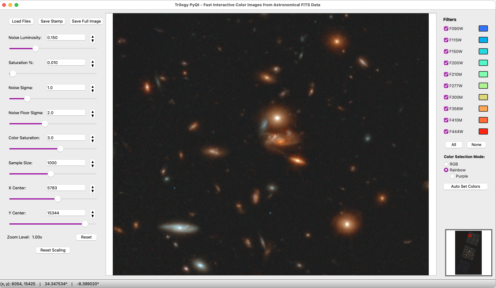

# Trilogy

[https://github.com/dancoe/trilogy](https://github.com/dancoe/trilogy)  
Dan Coe + AI (Gemini, Claude, Cursor) 🚀

🤩 Trilogy creates beautiful color images based on astronomical FITS files. 
⚡️ This new version [trilogy_pyqt.py](https://github.com/dancoe/Trilogy/blob/main/trilogy_pyqt.py) uses [PyQt](https://doc.qt.io/qtforpython-6) to quickly generate color images that you can pan & zoom through in an interactive GUI. Thanks to Tom Resseguier for showing me PyQt!
🌈 The image scaling will adjust based on the stamp shown (1000x1000 pixels by default). Avoid bright stars that will saturate the scaling. 
💾 If you like the way it looks, you can save the image stamp, or even the full image file as PNG or RGB fits.

## Quick Start
    bash
    pip install "numpy>=1.24,<2.3" PyQt5 astropy pillow scipy numba
    python trilogy_pyqt.py
    
*I found numba clashed with numpy 2.3; an earlier version is required.
`PySide2` can be used as a substitute for `PyQt5`*



[VENUS](https://jwst-venus.github.io) + [Cosmic Spring](https://cosmic-spring.github.io) JWST NIRCam imaging of WHL0137-08 flanking field

## Image Scaling

Trilogy uses log scaling constrained at three points (hence the name "tri-log"-y).  
The functional form used to accomplish this is y = log10( k * (x - x0) + 1 ) / r.

The three points are (by `default` / for example):

| Variable | x | y |
|----------|----------|----------|
| `noise floor sigma`    | mean – `2`-sigma     | 0 (black)     |
| `noise sigma`    | mean + `1`-sigma     | `0.12` (`noise luminosity`)  |
| `saturation %`    |  percentile of pixels    | 1 (white) |


## To Do
* Robust extraction of image filters and wavelengths
* Support large mosaics
* Test larger image stamp sizes
* Update tri-log image scaling to include other options like asinh and CLAHE

---

## Legacy Information

Trilogy color images

Automatically convert FITS images into pretty pictures

Most recent example:
* https://github.com/cosmic-spring/Earendel/blob/main/Trilogy%20color%20images%20WHL0137%20Sunrise%20Arc%20Earendel.ipynb

Other examples:
* https://github.com/dancoe/Trilogy/blob/main/Trilogy%20color%20images%20Webb%20focus%20field.ipynb
* https://github.com/dancoe/Trilogy/blob/main/Trilogy%20NIRCam%20color%20images.ipynb
* https://github.com/dancoe/CEERS/blob/main/NIRCam%20Trilogy%20color%20images.ipynb
* https://github.com/dancoe/mirage/blob/main/Trilogy%20color%20images%20NIRCam.ipynb


Recent adaptation to Python 3:
https://github.com/oliveirara/trilogy

Original code: https://www.stsci.edu/~dcoe/trilogy

### Load RGB FITS image into ds9

* Scale -- Min Max
* Frame -- New Frame RGB
* File -- Open as -- RGB Image...

### Load RGB FITS image into APT Aladin

* Aladin
* Cmd-I
* File
* Browse
* RGB fits image
* (3 planes show up in Aladin)
* rgb
  * red = RGB[1]
  * green = RGB[2]
  * blue = RGB[3]

### Load RGB FITS image into Python

```
color_image_hdulist = fits.open(color_image_file)
color_image_wcs = wcs.WCS(color_image_hdulist[0].header, color_image_hdulist)
color_image_data = np.stack([hdu.data for hdu in color_image_hdulist[1:]], axis=-1)
``` 